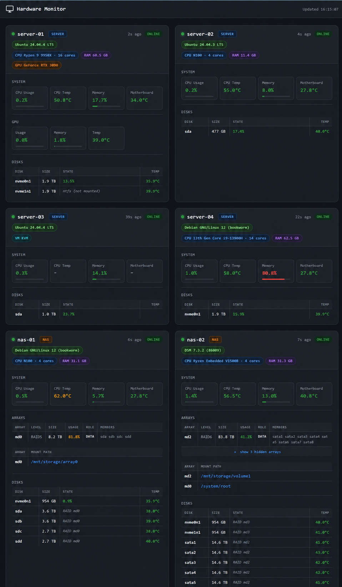

#  Hardware Monitor

[English](README.md) | [中文](README.zh-CN.md)

[](LICENSE)
[](https://www.python.org)
[](Dockerfile)

A lightweight, push-based hardware monitoring system for Linux machines on a local network. Each monitored machine runs a small agent that periodically collects hardware metrics and pushes them to a central server. The central server aggregates data from all agents, serves a real-time web dashboard, and dispatches alerts when thresholds are exceeded or machines go offline.

<p align="center">
  
  <br>
  <em>Real-time dashboard showing a mix of servers and NAS units, with arrays, disks, and temperatures color-coded by severity.</em>
</p>

## Features

- **Push model** — agents initiate all communication; the server never polls. Adding a new machine is one install command.
- **Stateless server** — all state lives in memory. Restart anytime with no data loss beyond the in-flight window.
- **Minimal agent dependencies** — only `psutil` (and optionally `pynvml` for NVIDIA GPUs); HTTP via stdlib `urllib`.
- **NAS-friendly** — first-class support for mdadm arrays, LVM, bcache, ZFS, LUKS; verified on Synology DSM, OpenMediaVault, TrueNAS.
- **Configurable alerts** — per-metric thresholds with per-machine overrides; cooldowns prevent alert floods.
- **Pluggable notifiers** — email and WeChat out of the box via the [notifier](https://github.com/augaria/notifier) library.
- **Real-time dashboard** — dark-themed responsive grid, polls every 5s, color-coded by severity.

## Architecture

```
Monitored machines (N)              Central server (1)
┌──────────────────────┐            ┌──────────────────────────────────────┐
│  hardware-monitor-   │            │  central_server/main.py              │
│  agent               │            │  ┌────────────────────────────────┐  │
│                      │  POST      │  │  in-memory cache               │  │
│  psutil + pynvml     │  /report   │  │  machine → {data, last_seen}   │  │
│  every N seconds     │ ─────────► │  └────────────────────────────────┘  │
│                      │            │  GET /api/status   (JS polling)      │
│  systemd managed     │            │  POST /report      (agent push)      │
└──────────────────────┘            │                                      │
                                    │  central_server/alerter.py           │
                                    │  - threshold checks                  │
                                    │  - per-alert cooldowns               │
                                    │  - notifier dispatch                 │
                                    │                                      │
                                    │  Docker container                    │
                                    └──────────────────────────────────────┘
```

## Quick Start

### 1. Run the central server (Docker)

```bash
git clone https://github.com/augaria/hardware-monitor.git
cd hardware-monitor

# Build the image
./docker-build.sh

# Configure
cp docker-compose.sample.yml docker-compose.yml
# Edit docker-compose.yml — fill in port, thresholds, and notifier channels

# Run
docker compose up -d
```

The dashboard is now at `http://<server-ip>:<PORT>` (default port `5000`).

### 2. Install an agent on each monitored machine

**Prerequisite:** Miniconda or Anaconda installed on the target machine.

```bash
# Download the installer first, then run it — the installer is interactive,
# so piping curl directly to bash will not work (stdin would be the pipe).
curl -fLO https://raw.githubusercontent.com/augaria/hardware-monitor/main/scripts/install.sh
sudo bash install.sh
```

The installer prompts for the central server URL, machine name, and report interval, creates a conda env, installs the agent, and starts a systemd service.

**Update an existing install** (re-pulls the agent, preserves config):

```bash
sudo bash install.sh --update
```

Verify with `systemctl status hardware-monitor-agent`.

## Metrics Collected

**Static info** (collected once at startup, included in every report):

| Field | Source |
|---|---|
| `is_vm`, `virt_type` | `systemd-detect-virt` |
| `machine_type` | `nas` if OMV / TrueNAS / DSM / QNAP / Unraid markers present; else `server` |
| `cpu_model`, `cpu_cores` | `/proc/cpuinfo`, `psutil.cpu_count(logical=False)` |
| `memory_total_gb` | `psutil.virtual_memory().total` |
| `gpu_model` | `pynvml.nvmlDeviceGetName` (NVIDIA only) |

**Live metrics** (collected every reporting interval):

| Field | Source |
|---|---|
| `os_name` | `/etc/os-release` `PRETTY_NAME` (falls back to Synology's `/etc.defaults/VERSION`) — re-read each cycle so OS upgrades show up without an agent restart |
| `cpu_usage`, `cpu_temp` | `psutil` (`k10temp` / `coretemp`) |
| `memory_usage`, `memory_used_gb` | `psutil.virtual_memory` |
| `motherboard_temp` | `acpitz` / IT8x / NCT67xx / W83 / ASUS chips |
| `gpu_usage`, `gpu_memory_usage`, `gpu_temp` | `pynvml` (NVIDIA only) |
| `disks` | per-disk `{name, total_gb, used_pct, temp, state}` from `/sys/block`. SATA temps via `smartctl -A`; NVMe temps via sysfs hwmon, `psutil`, Synology `synonvme`, or `smartctl`. State labels: `mounted`, `RAID mdN`, `LVM PV`, `SSD cache`, `ZFS pool`, `LUKS (locked)`, `<fstype> (not mounted)`, `unmounted`. |
| `arrays` | per-mdadm-array `{name, level, state, role, total_gb, used_pct, mount, members}` from `/proc/mdstat`. Mount discovery walks `holders/` upward, every mount's `slaves/` chain downward, then capacity-matches against unattributed `dm-*` mounts (bridges Synology DSM's hidden cache→data link). `role` is `data` / `cache` / `swap`. |

Unavailable fields are reported as `null`; the server and dashboard handle them gracefully.

## Configuration

All central-server configuration is via environment variables (see [docker-compose.sample.yml](docker-compose.sample.yml) for the full reference).

### Server

| Variable | Default | Description |
|---|---|---|
| `PORT` | `5000` | Port the Flask app listens on |
| `OFFLINE_TIMEOUT` | `30` | Seconds without a report before a machine is marked offline |
| `ALERT_COOLDOWN_MINUTES` | `10` | Minimum minutes between repeated alerts for the same key |
| `HIDE_ARRAYS_BELOW_GB` | `10` | Dashboard auto-collapses arrays smaller than this (and SSD-cache arrays) |

> **Tip:** set `OFFLINE_TIMEOUT` to several times the agent's `--interval` (e.g. 180–300s for a 60s interval) so a single missed report doesn't trigger a false-positive offline alert.

### Alert thresholds

Leave a variable unset or empty to disable that alert.

| Variable | Unit | Example |
|---|---|---|
| `ALERT_CPU_USAGE` | % | `90` |
| `ALERT_CPU_TEMP` | °C | `85` |
| `ALERT_MEMORY_USAGE` | % | `90` |
| `ALERT_MOTHERBOARD_TEMP` | °C | `75` |
| `ALERT_GPU_USAGE` | % | `95` |
| `ALERT_GPU_TEMP` | °C | `85` |
| `ALERT_GPU_MEMORY` | % | `90` |
| `ALERT_DISK_TEMP` | °C | `60` |

These are server-wide defaults. Individual agents can ship their own per-machine override file — see below.

### Notification channels

Set `NOTIFIER_CHANNELS` to a JSON array of channel configs. Supported types: `email`, `wechat`.

```json
[
  {
    "type": "email",
    "smtp_server": "smtp.example.com",
    "email": "alerts@example.com",
    "passkey": "app-password",
    "recipients": ["admin@example.com"],
    "min_level": 30
  }
]
```

`min_level`: `10`=DEBUG, `20`=INFO, `30`=WARNING, `40`=ERROR, `50`=CRITICAL. Multiple channels can route different levels to different destinations.

## Per-Agent Threshold Overrides

Some machines are noisier than others — a build server idling at 80 °C is fine, while a NAS at 80 °C is not. Each agent can ship its own threshold file, and the central server merges those values on top of the docker-compose defaults **per metric**, so an agent only needs to specify the keys it wants to change.

**File format** (simple `KEY=VALUE`, `#` for comments — same names as the server-side env vars):

```ini
# /etc/hardware-monitor/thresholds.conf
ALERT_CPU_TEMP=80          # this machine runs hot, raise the bar
ALERT_DISK_TEMP=55         # NAS spinners — be stricter
#ALERT_CPU_USAGE=85        # commented out → server default applies
```

A complete commented template is at [agent/thresholds.sample.conf](agent/thresholds.sample.conf).

**Wiring it up:**

| Task | Command |
|---|---|
| First-time install with overrides | `sudo bash install.sh --thresholds-file /etc/hardware-monitor/thresholds.conf` |
| Tweak a value (file already wired up) | edit the `.conf`, then `sudo systemctl restart hardware-monitor-agent` |
| Enable on a machine that doesn't yet have one | `sudo bash install.sh --update --thresholds-file /etc/hardware-monitor/thresholds.conf` |
| Disable (revert to server defaults) | `sudo bash install.sh --update --thresholds-file ""` |
| Re-pull the agent without touching threshold config | `sudo bash install.sh --update` |

`--update` mode is fully non-interactive (so it can run from cron / Ansible / CI) and never prompts about thresholds — pass `--thresholds-file` explicitly when you need to change the wiring.

## Web Dashboard

The dashboard polls `GET /api/status` every 5 seconds and rebuilds the machine grid on each response.

Each card shows:

- **Header** — machine name, `SERVER` / `NAS` type badge, online/offline status dot, last-seen timestamp. Sorted servers-first, then NAS, alphabetical within each group.
- **Hardware badges** — OS, CPU + cores, RAM, GPU (or just `VM <type>` for VMs).
- **System row** — CPU usage / temp, memory usage, motherboard temp.
- **GPU row** (if present) — usage, VRAM, temp.
- **Arrays table** — one row per mdadm array with level, size, usage, role (`DATA` / `CACHE` / `SWAP`), and member disks. Mount paths listed below the table. Small / cache arrays auto-collapse behind a "+ show N hidden" toggle.
- **Disks table** — name, capacity, state-or-usage, temperature. Unmounted disks show their role (e.g. `RAID md2`, `LVM PV`, `ZFS pool`) instead of a usage %.

Values are color-coded by severity (green / yellow / red). The visual thresholds are independent from the server-side alert thresholds and are defined in [central_server/static/app.js](central_server/static/app.js).

## Project Structure

```
hardware-monitor/
├── agent/
│   ├── hardware_monitor_agent/
│   │   └── main.py              # Metric collection + HTTP POST loop
│   ├── thresholds.sample.conf   # Commented template for per-agent threshold overrides
│   └── pyproject.toml           # Package definition; entry point: hardware-monitor-agent
├── central_server/
│   ├── main.py                  # Flask app: /report, /api/status, offline watcher
│   ├── alerter.py               # Threshold checks, cooldown logic, notifier dispatch
│   ├── templates/
│   │   └── index.html           # Dashboard HTML skeleton
│   └── static/
│       ├── app.js               # Polling loop + DOM card builder
│       ├── style.css            # Dark theme, responsive grid
│       └── favicon.png
├── scripts/
│   └── install.sh               # Agent installer (interactive / --update)
├── Dockerfile                   # Python 3.11-slim + Flask + notifier
├── docker-build.sh              # Docker build + optional push
├── docker-compose.sample.yml    # Reference config with all supported env vars
├── LICENSE
└── README.md
```

## License

[MIT](LICENSE) © augaria
